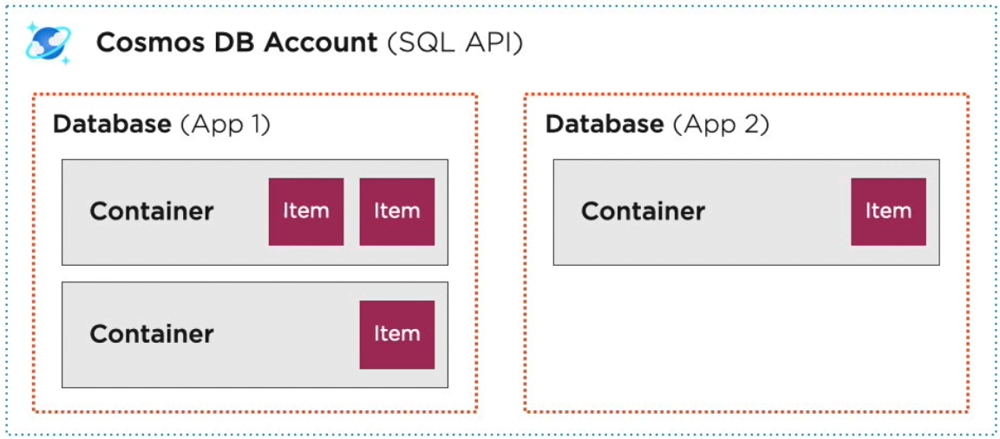

# Cosmos DB



## Supported APIs
|   **API**   | **Database** entity type | **Container** entity type |
|:-----------:|:------------------------:|:-------------------------:|
|  Casandra   |         Keyspace         |           Table           |
|   MongoDB   |         Database         |        Collection         |
|   Gremlin   |         Database         |           Graph           |
| Azure Table |      Not applicable      |           Table           |
|     SQL     |         Database         |         Container         |

## Scaling
- Cosmos DB is a managed service, so we cannot specify vertical or horizontal scaling
- The concept of scaling is covered by what is called `**Request Unit**` (RU)
- A Request Unit encapsulates many of the resources needed for the DB into a single unit
- As a baseline, one RU is equal to a 1kb item read operation from a Cosmos DB container
- Resources encapsulated in RU's: 
  - Processing power (CPU)
  - Memory
  - IOPS (Input/Output Operations per Second)

- Managing Cosmos DB Throughput
  - Provisioned
    - Ideal for always-on production implementation
    - Can be configured at the DB or container
    - Is evenly distributed to partitions
    - Requires 10 RU's per GB of storage
    - Once RU's are consumed for a partition, future requests will be rate limited
    - By default, it requires a manual scaling approach to acquire more RU's
    - Also permits autoscaling
  - Serverless
    - Pay only for the RU's consumed and storage used
    - Ideal for development workloads
    - Maximum of 5000 RU's
- Throughput best practices:
  - use a partition strategy to evenly spread throughput on partitions 
  - provision throughput at the container for predictable performance
  - use the serverless account type for development workloads
  - understand the link between the consistency types and the amount of RU's consumed

## Data consistency levels spectrum (from left to right, in the order below)
- Eventual consistency -> provides no guarantee for the order
- Consistent prefix -> guarantees that updates are returned in order
- Session -> guarantees that a client will read its own writes
- Bounded staleness -> guarantees that a read has a max lag (either versions or time)
- Strong -> guarantees that reads get the most recent version of an item


| **Consistency type** | **Latency** | **Throughput** | **Availability** |
|:--------------------:|:-----------:|:--------------:|:----------------:|
| Eventual consistency |    Lower    |     Higher     |      Higher      |
|  Consistent prefix   |             |                |                  |
|       Session        |             |                |                  |
|  Bounded staleness   |             |                |                  |
|        Strong        |   Higher    |     Lower      |      Lower       |

Consistency levels for SQL APIs
 - Account default -> specified at the account level, every operation will follow the account consistency level
 - Request-specific level -> overrides the account level

Consistency level for other APIs
- For Gremlin and Azure Table APIs **read** and **writes**, the account default consistency level is used
- For Cassandra 
  - **writes**, the account default consistency level is used
  - **reads**, the client consistency is mapped to a Cosmos DB level (specified in the documentation)
- For MongoDB: 
  - **writes**, the account default consistency level is used
  - **reads**, a mapping to a Cosmos FDB level will be used (specified in the documentation) -> Not the same as Cassandra

## Partitioning data in Cosmos DB
**Partition key**
```
ES analogy -> a shard location/key
Example1 -> a "productCategory" in which the product belongs: DRESSES or PANTS
Example2 -> even better -> a "productId" representing the unique id of the product from the original DB where it's coming from
```
  - serves as the means of routing your requests to the correct logical partition
  - made up for both the key and the value of the defined partition key
  - should be a value that does not change for the item
  - should have many, different values represented in the container
  - Azure Cosmos DB uses hash-based partitioning to spread logical partitions across physical partitions
  - it hashes the partition key value of an item
  - then, it allocates the key space of partition key hashes evenly across the physical partitions

**Logical partition**
```
ES analogy -> shard/buckets of data for which the partiion key has been hashed to the same value
Based on the previous "productId" partition key, we would have many logical partitions and the throughput would be evenly spread  
``` 
  - a set of items within a container, that share the same partition key
  - a container can have as many logical partitions as it needs, but each partition is limited to 20 GB of storage
  - logical partitions are managed by Cosmos DB, but their use is governed by your partition key strategy

**Physical partition**
```
ES analogy -> nodes containing one or multiple shards
```
  - a container is scaled by distributing data and throughput across physical partitions
  - internally, one or more logical partitions ar mapped to a single physical partition
  - they are entirely managed by Cosmos DB

**Replica set**
```
ES analogy -> Shard replicas
```
  - a physical partition contains multiple replicas of the data, known as a replica set
  - by having the data replicated, we enable the storage to be durable and fault tolerant
  - the replica sets are managed by Cosmos DB

## Partition key strategy considerations
- **The partition key (the value) for an object cannot change in time**
- **The partition key strategy is really important and needs to be decided before creating the container**
- **Throughput is distributed evenly across all of your physical partitions**
  - remember the scenario in which the partition key is not properly selected, and we end upt having a partition
    containing 95% of the data and another containing the rest of 5%. The 95% partition is called a "hot partition"
    and it needs to be avoided
  - in this case, if we have 20000 RUs, they would be spread evenly on the 2 partitions, meaning each partition is allocated
    10000 RUs, which means it's not properly balanced -> we pay for lots of RUs on the 5% partitions, and the 95% partition needs
    additional RUs. So, of course, we need to scale up ad that would mean also adding additional RUs to the 5% partition because
    of the rule to evenly spread the RUs over partitions
- Multi-item transactions require triggers or stored procedures
- Minimize cross-partition queries for heavier workloads

## Server-side Execution Environment
1. Approaches that enable execution on the Cosmos DB engine
- Can be created via the portal or the SDK
- **Stored Procedures**
  - need to be written in Javascript
  - executes on a single logical partition
  - partition key must be provided with the execution request
  - supports a transaction model
- **Triggers**
  - need to be written in Javascript
  - can be executed before or after data is written to the DB (pre-trigger or post-trigger)
  - pre-triggers can handle data transformation and validation
  - post-triggers can handle aggregations and change notifications
  - are not guaranteed to execute, as they have to be specified in a request
  - errors in pre- or post-filters will result in a rollback
- **User Defined Functions (UDFs)**
  - need to be written in Javascript
  - can define a function that can be leveraged in a query
  - enables encapsulation of common logic in query conditions

2. Reacting to changes using server-side code outside of the Cosmos FB engine  
- **Change Feed Processing** 
  - Enables you to be notified for any insert and update on your data
  - Deletes are not directly supported with change feed processing, but you can leverage a soft-delete flag
  - A change will appear exactly once in the change feed
  - Reading data from the DB using change feed, will consume throughput
  - Partition updates will be in order, but between partitions there is no guarantee
  - Is not supported for the Azure Table API
- Change feed approaches
  - Azure functions
  - Change feed processor
